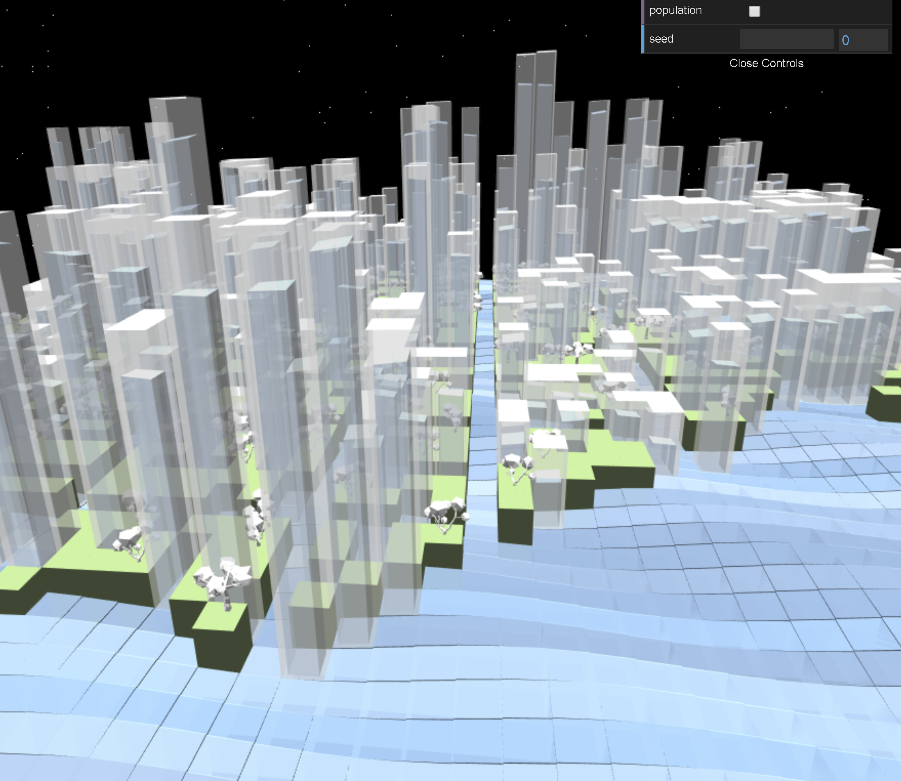
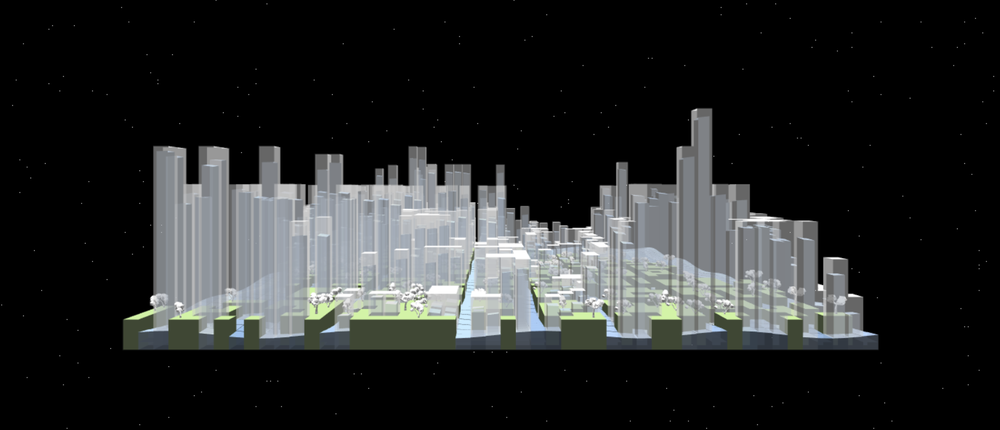

# Hanyu Liu (liuhanyu) - Ocean City

Do you ever wonder what a city for fish would look like? Do you ever wish fish could see above sea level? Well...

Welcome to Ocean City, a city made for fish! (Not to be confused by the Dim Sum place in Chinatown). Here in Ocean City, the streets are filled with water, so fish can get to where they want to go. The buildings are glass tubes filled with water, so fish can swim up and see above sea level! There are also various trees in the city because nature increase productivity -- and that goes for fish too!

## Demo

https://helenl9098.github.io/hw06-city-generation/ 

(Zoom out)

## Implementations

- __City Layout__: First, I used a fbm noise function to separate land and water. Then, I added roads to the land using a grid system from last week's assignment. The placements of the roads were offset by a random value in both the x and z direction. The offset is determined by the seed, so when we change the seed, the positions of the road changes. The roads are made so that at the very least they have to be 2 blocks apart, leaving room for the buildings. When given a coordinate, the grid would know if the block is water, land, or road. Thus, the world is formed from cube vertex data rendered using instanced rendering. 

- __Population__: The population of the city was determined using a fbm noise function. When given a coordinate, the grid would know the population at the block. You can view the world in population mode through the controls panel. In population mode, all possible building areas are shades of red. The higher the block and lighter the color, the more populated an area is. 

- __Building Generation__: The placement of the buildings are determined by a random noise value. Buildings can only be placed on land not occupied by roads. The building would start at a certain height depending on the population at the current coordinate then extend downwards. The heights of the buildings are normalized so that similar heights merge into one. The noise is also altered so that many building coordinates have adjacent buildings so that buildings combine and are thus larger.  

- __Tree Generation__: The placement of the trees are determined by a random noise value. Trees can only be place on land not occupied by buildings or roads. There are two variations of trees, loaded in by objs. The trees are rotated by a random number of degrees along the y axis to increase variance. 

- __Water__: The water inside the buildings are blocks rendered with instance rendering. The movement of the water is done in the instance vertex shader, where its vertices are offset over time using a sin curve in the x and z direction. The water height inside the building starts at a random height (not less than half of the height of the glass), and bobs up and down at a set speed. The bobbing is offset by a random value, so that the water don't all bob at the same time. 

- __Colors and Shading__: Most of the scene relies on transparency, so the alphas of the water and glass would have to be < 1. The water's color also changes over time using a voronoi noise function. The scene is lit by two lambert diffuse terms. The tops of the buildings are white so that it is easy to see where the buildings end.  

- __Night Sky__: The stars in the night sky are procedurally generated using noise. The frequency of the stars were determined by a set probability. They are modified over time using a sin curve, to blink very slightly. 

## Modifiable Features

- __Population View__: Toggle to turn on and off population view. Population view is where the height of the land becomes proportional to the population. 

- __Seed__: Altar the offsets of the road and how they are built. 

## Resources
- https://www.shadertoy.com/view/lsfGWH
- https://blog.mayflower.de/4584-Playing-around-with-pixel-shaders-in-WebGL.html
- http://www.iquilezles.org/www/articles/voronoilin
- https://www.turbosquid.com/3d-models/sample-trees-c4d-free/1008420
- https://www.turbosquid.com/3d-models/free-3ds-model-trees-scene/961487

